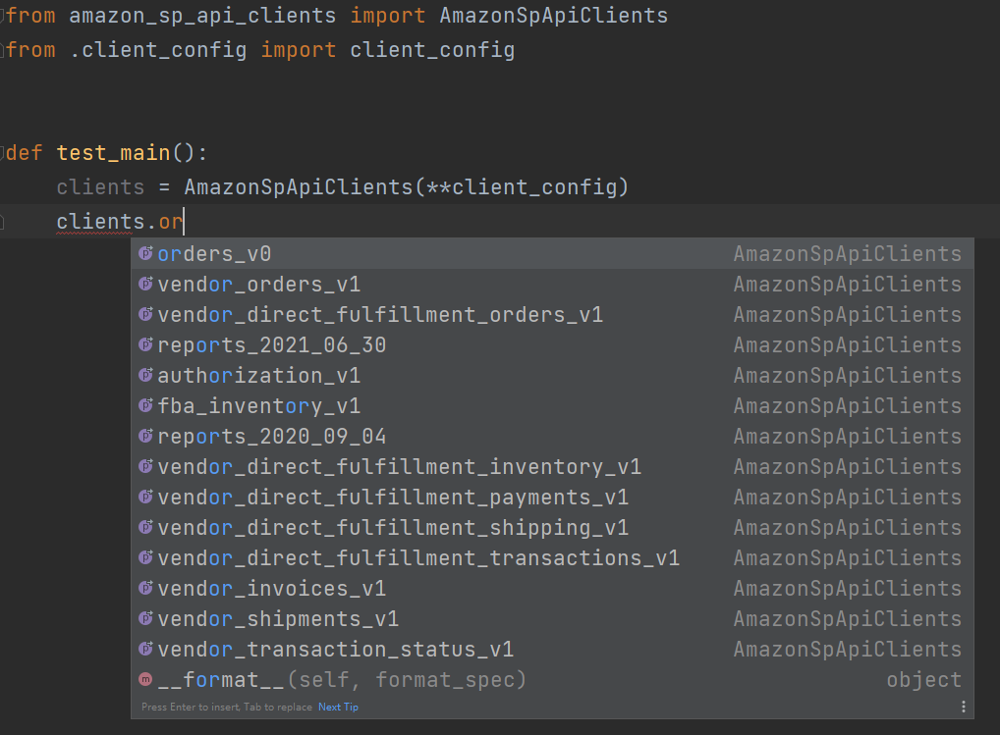

# amazon-sp-api-clients

This is a package generated from amazon selling partner open api models.

The package is tested in many situations, with fully type hint supported. Enjoy it! 




## Attention

V1.0.0 changes many api, compared with v0.x.x!

注意！V1.0.0相较于v0.x.x更改了大量的API！

## Features

* ready to use;
* provide code to generate clients, in case that amazon update models;
* type hint;
* orders api, feed api, report api, and all other apis;
* automatically manage tokens.

## Installation

```shell
pip install amazon-sp-api-clients
```

## Note

For technical support, please contact [panhaoyu.china@outlook.com](mailto:panhaoyu.china@outlook.com).

Previously this lib is only open access but not open source, and now it's time to make it public to serve more developers.

If there's any bug, please fell free to open an issue or send a pr.

## Usage

For saving time, I just paste part of my test code here as a demo.

For better understanding, all the fields are the same length of actual fields, and some readable information are kept.

```python
def test_api():
    from datetime import datetime
    import amazon_sp_api_clients
    endpoint = "https://sellingpartnerapi-eu.amazon.com"
    marketplace_id = "XXXXXXXXXXXXXX"

    refresh_token = "xxxxxxxxxxxxxxxxxxxxxxxxxxxxxxxxxxxxxxxxxxxxxxxxxxxxxxxxxxxxxxxxxxxxxxxxxxxxxxxxxxx"
    "xxxxxxxxxxxxxxxxxxxxxxxxxxxxxxxxxxxxxxxxxxxxxxxxxxxxxxxxxxxxxxxxxxxxxxxxxxxxxxxxxxx"
    "xxxxxxxxxxxxxxxxxxxxxxxxxxxxxxxxxxxxxxxxxxxxxxxxxxxxxxxxxxxxxxxxxxxxxxxxxxxxxxxxxxx"
    "xxxxxxxxxxxxxxxxxxxxxxxxxxxxxxxxxxxxxxxxxxxxxxxxxxxxxxxxxxxxxxxxxxxxxxxxxxxxxxxxxxx"


order_pk = '123-1234567-1234567'
role_arn = "arn:aws:iam::123456789012:role/xxxxxx"
aws_access_key = 'XXXXXXXXXXXXXXXXXXXX'
aws_secret_key = "XXXXX/XXXXXXXXXXXXXXXXXXXXXXXXXXXXXXXXXX"
client_id = 'amzn1.application-oa2-client.xxxxxxxxxxxxxxxxxxxxxxxxxxxxxxxx'
client_secret = 'xxxxxxxxxxxxxxxxxxxxxxxxxxxxxxxxxxxxxxxxxxxxxxxxxxxxxxxxxxxxxxxx'
client_config = dict(
    role_arn=role_arn,
    endpoint=endpoint,
    marketplace_id=marketplace_id,
    refresh_token=refresh_token,
    aws_access_key=aws_access_key,
    aws_secret_key=aws_secret_key,
    lwa_client_key=client_id,
    lwa_client_secret=client_secret,
)
order_client = amazon_sp_api_clients.OrdersV0Client(**client_config, use_cache=True)

orders = order_client.getOrders(
    MarketplaceIds=[marketplace_id],
    CreatedAfter=datetime(2000, 1, 1).isoformat()).payload.Orders
assert len(orders) > 0
assert orders[0].AmazonOrderId == order_pk

```

## Configuration

The client configuration can be set both at the initiation and as environment variables.

* SP_API_ROLE_ARN
* SP_API_ENDPOINT
* SP_API_REGION
* SP_API_MARKETPLACE
* SP_API_REFRESH_TOKEN
* SP_API_AWS_KEY
* SP_API_AWS_SECRET
* SP_API_LWA_KEY
* SP_API_LWA_SECRET

## Build

The client is generated in the following steps:

1. download amazon open api repository;
1. copy open api 2 json files from the amazon repository to a single directory;
1. convert open api 2 json files to open api 3 json files;
1. convert open api 3 json files to py clients.

The main script of generation is the `test_main` python file.

When convert open api to py clients, I separated the process into 6 steps, which are defined in
the `swager_client_generator.stages` module.

If my build is not suitable for your demand, or amazon api model updates but my build do not follow, you can clone this
repo, modify the `api.pyt` template and build it by yourself, and please push a PR, thanks!

# Acknowledgement

The auth method is partially from
[python-amazon-sp-api](https://github.com/saleweaver/python-amazon-sp-api).

# Note

If this library helps you, please give me a star, thanks!

# Contribution

The project use django template for rendering.
Thanks to the type hint in the template.

如果这个库对您有用，请为我点亮Star，谢谢！
